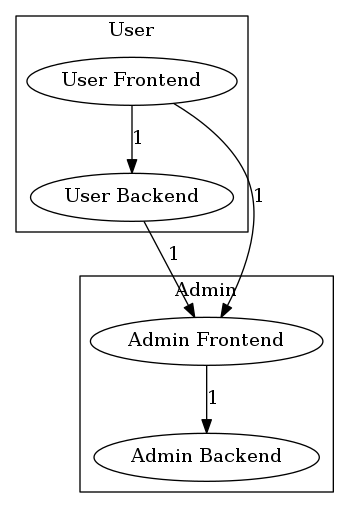

# Formatters

Deptrac has support for different output formatters with various options.

You can get a list of available formatters by running,

```bash
php deptrac.php analyse --help
```

* [Baseline Formatter](#baseline-formatter)
* [Console Formatter](#console-formatter)
* [GitHubActions Formatter](#githubactions-formatter)
* [Graphviz Formatter](#graphviz-formatter)
  * [Hide layers in output](#hide-layers-in-output)
  * [Group layers](#group-layers)
* [JSON Formatter](#json-formatter)
* [JUnit Formatter](#junit-formatter)
* [Table Formatter](#table-formatter)

## Baseline Formatter

The Baseline formatter is a console formatter, which generates
the `skip_violations` section to the given File. With this formatter it's
possible to start on a project with some violations without a failing CI Build.

*Note*: It's not the best solution to ignore all the errors because maybe your
current Architecture doesn't allow a change without a new violation.

It can be activated with `--formatter=baseline`.

Supported options:

```
--output[=BASELINE-DUMP] path to a dumped baseline file [default: "./depfile.baseline.yml"]
```

Don't forget to include the baseline into your existing `depfile.yml`

```yaml
# depfile.yml
baseline: depfile.baseline.yml
```

## Console Formatter

The default formatter is the console formatter, which dumps basic information
to *STDOUT*,

```
examples\MyNamespace\Repository\SomeRepository::5 must not depend on examples\MyNamespace\Controllers\SomeController (Repository on Controller)
```

## GitHubActions Formatter

The GithubActions formatter is a console formatter, which dumps basic information
in github-actions format to *STDOUT*. This formatter is enabled by default while
running in a GitHub actions environment. It can be activated manually
with `--formatter=github-actions`.

```
::error file=/home/testuser/originalA.php,line=12::ACME\OriginalA must not depend on ACME\OriginalB (LayerA on LayerB)
```

## Graphviz Formatters

There is a whole family of Graphviz formatters for you to choose from depending
on what type of output you are expecting. They can be activated with:

```
--formatter=graphviz-display    Automatically tries to open the image
--formatter=graphviz-dot        Saves the output to a .dot file
--formatter=graphviz-html       Saves the output to a .html file
--formatter=graphviz-image      Saves the output to a .png file
```

Supported options:

```
--output= path to a dumped file
```

#### Hide layers in output

Under `formatters.graphviz.hidden_layers` you can define a list of `layers` you
do not want to include when using the corresponding `graphviz` output formatter.
The generated image will not contain these layers, but they will be part of the
analysis.

There are 2 main use-cases for this feature:

- Hiding a generic/general domains like the `vendor` folder
- Having multiple "views" for your architecture. You can define a shared file
  with all your `layers` and a `ruleset` and then have multiple config files for
  the different `hidden_layers`. Using the `graphviz` formatter with these files
  will then generate graphs focusing on only the relevant layers.

```yaml
layers:
  -
    name: Utils
    collectors:
      -
        type: className
        regex: .*Util.*
  -
    name: Controller
    collectors:
      -
        type: className
        regex: .*Controller.*
ruleset:
  Controller:
    - Utils
formatters:
  graphviz:
    hidden_layers:
      - Utils
```

#### Group layers

Another supported option is `formatters.graphviz.groups`. There you can sort
layers into groups that will be rendered as sub-graphs in GraphViz output.

The following config:

```yaml
layers:
  - User Frontend
  - User Backend
  - Admin Frontend
  - Admin Backend
formatters:
  graphviz:
    groups:
      User:
        - User Frontend
        - User Backend
      Admin:
        - Admin Frontend
        - Admin Backend
```

Will produce the following graph:



#### Pointing to groups instead of nodes
With `formatters.graphviz.pointToGroups` set to `true`, when you have a node inside a groups with the same name as the group itself, edges pointing to that node will point to the group instead. This might be useful for example if you want to provide a "public API" for a module defined by a group.

## JSON Formatter

By default, Json formatter dumps information to *STDOUT*. It can be activated
with `--formatter=json`

```json
{
  "Report": {
    "Violations": 1,
    "Skipped violations": 2,
    "Uncovered": 1,
    "Allowed": 0,
    "Warnings": 0,
    "Errors": 0
  },
  "files": {
    "src/ClassA.php": {
      "violations": 2,
      "messages": [
        {
          "message": "ClassA must not depend on ClassB (LayerA on LayerB)",
          "line": 12,
          "type": "error"
        },
        {
          "message": "ClassA should not depend on ClassC (LayerA on LayerB)",
          "line": 15,
          "type": "warning"
        }
      ]
    },
    "src/ClassC.php": {
      "violations": 1,
      "messages": [
        {
          "message": "ClassC should not depend on ClassD (LayerA on LayerB)",
          "line": 10,
          "type": "warning"
        }
      ]
    },
    "src/OriginalA.php": {
      "violations": 1,
      "messages": [
        {
          "message": "OriginalA has uncovered dependency on OriginalB (LayerA)",
          "line": 5,
          "type": "warning"
        }
      ]
    }
  }
}
```

Supported options:

```
--output= path to a dumped json file
```

## JUnit Formatter

The JUnit formatter dumps a JUnit Report XML file, which is quite handy in CI
environments. It is disabled by default, to activate the formatter just
use `--formatter=junit`.

```xml
<?xml version="1.0" encoding="UTF-8"?>
<testsuites>
    <testsuite id="1"
        package=""
        name="Controller"
        timestamp="2018-06-07T10:09:34+00:00"
        hostname="localhost"
        tests="3"
        failures="2"
        errors="0"
        time="0">
        <testcase name="Controller-examples\Layer1\AnotherClassLikeAController"
            classname="examples\Layer1\AnotherClassLikeAController"
            time="0">
            <failure message="examples\Layer1\AnotherClassLikeAController:5 must not depend on examples\Layer2\SomeOtherClass (Controller on Layer2)"
                type="WARNING" />
            <failure message="examples\Layer1\AnotherClassLikeAController:23 must not depend on examples\Layer2\SomeOtherClass (Controller on Layer2)"
                type="WARNING" />
        </testcase>
    </testsuite>
    <testsuite id="2"
        package=""
        name="Layer2"
        timestamp="2018-06-07T10:09:34+00:00"
        hostname="localhost"
        tests="3"
        failures="4"
        errors="0"
        time="0">
        <testcase name="Layer2-examples\Layer2\SomeOtherClass2"
            classname="examples\Layer2\SomeOtherClass2"
            time="0">
            <failure message="examples\Layer2\SomeOtherClass2:5 must not depend on examples\Layer1\SomeClass2 (Layer2 on Layer1)"
                type="WARNING" />
            <failure message="examples\Layer2\SomeOtherClass2:17 must not depend on examples\Layer1\SomeClass2 (Layer2 on Layer1)"
                type="WARNING" />
        </testcase>
        <testcase name="Layer2-examples\Layer2\SomeOtherClass"
            classname="examples\Layer2\SomeOtherClass"
            time="0">
            <failure message="examples\Layer2\SomeOtherClass:5 must not depend on examples\Layer1\SomeClass (Layer2 on Layer1)"
                type="WARNING" />
            <failure message="examples\Layer2\SomeOtherClass:17 must not depend on examples\Layer1\SomeClass (Layer2 on Layer1)"
                type="WARNING" />
        </testcase>
    </testsuite>
</testsuites>
```

Supported options:

```
--output=     path to a dumped xml file [default: "./junit-report.xml"]
```

## Table Formatter

The table formatter groups results by layers to its own table. It can be
activated with `--formatter=table`.
